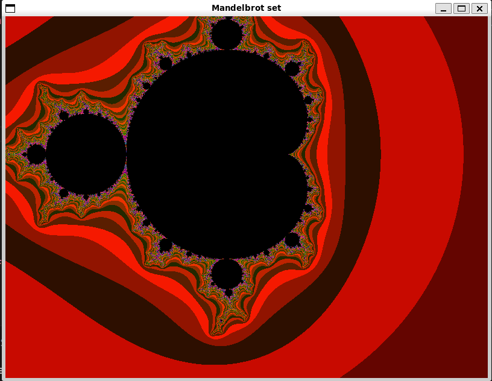

<h3 align="center">Mandelbrot optimisation</h3>

---

<p align="center"> Оптимизация расчётов множества мандельброта
    <br>
</p>

## 📝 Оглавление

- [Введение](#about)
- [Компиляция](#getting_started)
- [Параметры системы](#tests)
- [Измерения](#usage)
- [Обработка](#deployment)
- [Авторы](#authors)
- [Благодарности](#acknowledgement)

## 🧐 Введение <a name = "about"></a>


Каждому пикселю экрана соответствует точка P<sub>0</sub>=(Х0, Y0) на комплексной плоскости. Для каждой такой точки рассчитывается по формуле P<sub>n+1</sub> = P<sub>n</sub><sup>2</sup> + P<sub>0</sub>. Согласно теории, точка либо всегда будет внутри некоторого множества, именуемого множеством Мандельброта, либо уйдёт на бесконечность.

В зависимости от "скорости вылета", то есть шагов `n`, через которые точка уходит на "бесконечность" (в программе это расстояние регулируется параметром `R_square_max`) ставится в соответствие цвет в RGBA в соответствии с функцией `generatePixelColor`.

Если же точка не вылетает через `N_count_max` итераций, то считается, что она принадлежит множеству, и ей задаётся чёрный цвет

## 🏁 Режимы работы <a name = "getting_started"></a>
В программе есть несколько режимов работы
### Графический
#### Вызов
```./mandelbrot.exe --mode=graphic```
#### Управление
- `←, →, ↑, ↓` - перемещение по ХУ
- `+, -`       - изменение масштаба
### Расчётный
Данный режим реализован для проверки производительности расчёта `test_count` кадров функцией `func`
#### Вызов
```./mandelbrot.out --mode=test --func=SIMD --test_count=1000```
#### Описание функций
| Параметр `func` | Описание                                                                            |   |   |   |   |   |   |   |   |
|-----------------|-------------------------------------------------------------------------------------|---|---|---|---|---|---|---|---|
| SISD            | Single instruction single data. Обычный расчёт одного пискеля за один проход        |   |   |   |   |   |   |   |   |
| SIMD_manual     | Single instruction multiple Data. Искусственная векторизация для помощи компилятору |   |   |   |   |   |   |   |   |
| SIMD            | Аналогично верхнему, но вручную написаны команды avx через интринсики               |   |   |   |   |   |   |   |   |
| SIMDT_CPU       | T - threads. Запуск предыдущего режим на всех ядрах через OpenMP                    |   |   |   |   |   |   |   |   |
| SIMT_GPU        | Запуск на видекарте                                                                 |   |   |   |   |   |   |   |   |


## 🔧 Параметры системы <a name = "tests"></a>

| Процессор | Видеокарта | Компилятор | Операционная система |
|-----------|------------|------------|----------------------|
| 12th Gen Intel(R) Core(TM) i5-12600K | NVIDIA RTX 3070           | cl.exe + nvcc (Microsoft (R) C/C++ Optimizing Compiler Version 19.43.34809 for x64 + Cuda compilation tools, release 12.8, V12.8.93
Build cuda_12.8.r12.8/compiler.35583870_0) | Windows 10 OS Build: 19045.2130 |


| Процессор | Видеокарта | Компилятор | Операционная система |
|-----------|------------|------------|----------------------|
| 13th Gen Intel(R) Core(TM) i5-13420H |  Нет           | g++ version 12.2.0 (Debian 12.2.0-14)  | Linux (WSL2), Kernel 5.15.167.4 |

## 🎈 Измерения <a name="usage"></a>

### Методика измерений

Для измерения производительности использовался расчётный режим работы и функция `rdtscp`, берущая количество тактов. Для каждого процессора и режима работы значения полученные от счётчика сведены в таблицу. К сожалению, в настоящий момент не удалось реализовать avx команды на процессоре i5 12600K

#### Флаги компиляторов:
##### Для Windows
###### cl.exe
```blabla1```
###### nvcc
```blabla2```

##### Для Linux
###### g++
```blabla3```

### Производительность вычислений на CPU и GPU

| Номер опыта | SISD (i5 13420h, 100 кадров) (E+07) | SIMD_manual (i5 13420h, 500 кадров) (E+07) | SIMD (i5 13420h, 1000 кадров) (×10¹⁰) | SIMDT_CPU (i5 13420h, 1000 кадров) (E+07) | SISD (i5 12600k, 100 кадров) (E+07) | SIMD_manual (i5 12600k, 500 кадров) (E+07) | SIMT_GPU (i5 12600k + RTX 3070, 10000 кадров) (E+07) |
|------------|------|------|------|------|------|------|------|
| 1          | 1797 | 3937 | 5423 | 1491 | 2483 | 10526 | 10722 |
| 2          | 1805 | 3986 | 5326 | 2424 | 2487 | 10504 | 10724 |
| 3          | 1812 | 3886 | 5338 | 1776 | 2482 | 10392 | 10734 |
| 4          | 1825 | 3997 | 5349 | 1530 | 2518 | 10431 | 10735 |
| 5          | 1816 | 4058 | 5363 | 1399 | 2482 | 10391 | 10641 |
| 6          | 1810 | 4005 | 5367 | 1329 | 2492 | 10554 | 10694 |
| 7          | 1815 | 3991 | 5338 | 1425 | 2480 | 10355 | 10871 |

Отнормируем количество тактов на расчёт одного кадра

| Номер опыта | SISD (i5 13420h, 100 кадров) (E+04) | SIMD_manual (i5 13420h, 500 кадров) (E+04) | SIMD (i5 13420h, 1000 кадров) (×10¹⁰) | SIMDT_CPU (i5 13420h, 1000 кадров) (E+04) | SISD (i5 12600k, 100 кадров) (E+04) | SIMD_manual (i5 12600k, 500 кадров) (E+04) | SIMT_GPU (i5 12600k + RTX 3070, 10000 кадров) (E+04) |
|------------|------|------|------|------|------|------|------|
| 1          | 17967 | 7875 | 5423 | 1491 | 24837 | 21053 | 1072 |
| 2          | 18052 | 7974 | 5326 | 2424 | 24872 | 21008 | 1072 |
| 3          | 18120 | 7771 | 5338 | 1776 | 24829 | 20786 | 1073 |
| 4          | 18250 | 7994 | 5349 | 1530 | 25187 | 20823 | 1073 |
| 5          | 18166 | 8117 | 5363 | 1399 | 24825 | 20783 | 1064 |
| 6          | 18103 | 8011 | 5367 | 1329 | 24928 | 21108 | 1069 |
| 7          | 18151 | 7982 | 5338 | 1425 | 24800 | 20711 | 1087 |

## 🚀 Обработка <a name = "deployment"></a>

### Средние значения и отклонения

Найдём средние значения тактов на инструкцию в каждом случае, а также погрешность измерений

Все значения указаны в Е+04, т.е. для реального значения надо умножить число из таблицы на 10000.

| Параметр  | SISD (i5 13420h, 100 кадров) | SIMD_manual (i5 13420h, 500 кадров) | SIMD (i5 13420h, 1000 кадров) | SIMDT_CPU (i5 13420h, 1000 кадров) | SISD (i5 12600k, 100 кадров) | SIMD_manual (i5 12600k, 500 кадров) | SIMT_GPU (i5 12600k + RTX 3070, 10000 кадров) |
|-----------|------|------|------|------|------|------|------|
| **Среднее (Avg)** | 18116 | 7960 | 5357 | 1625 | 24897 | 20896 | 1073 |
| **Стандартное отклонение** | 33 | 41   | 12   | 143  | 51 | 59 | 2 |
| **Относительная ошибка** | 0.2% | 0.5% | 0.2% | 8.8% | 0.2% | 0.3% | 0.2% |

## Выводы
Из результатов видно, что использование мультипоточности через OpenMP позволило в разы ускорить выполнение расчётов, однако погрешность прироста нестабильна, что может быть связано с загржуенностью ядер другими процессами

Использование CUDA ядер GPU ускорило результат относительно `SISD` в 23 раза, в то время как при использовании многопоточности на другом процессоре максимальное ускорение составило 11 раз. Вероятно, есть ещё путь для оптимизации использования GPU и сейчас всё упирается в пропускную способность памяти, так как вычисления на самих ядрах не слишком сложные и проходят они быстро

На компиляторе g++ видно, что он увидел искусственную векторизацию и смог ускорить в 2.5 раза программу (странно, почему не в 4), в то время как использование интринсиков ускорило в 3.5 раза
Однако компилятор cl.exe не смог распознать векторизацию либо она просто не поддерживается, так что прирост менее чем в два раза. Вероятно, есть взаимосвязь между тем, что не получилось использовать интринсики на Windows и медленным выполнением искусственно векторизованного кода

## ✍️ Авторы <a name = "authors"></a>

- [@AndreyBritvin](https://github.com/AndreyBritvin) - основная работа

## 🎉 Благодарности <a name = "acknowledgement"></a>

- [Деду](https://github.com/ded32)
- [Ментору](https://github.com/Янезнаюсорри)
